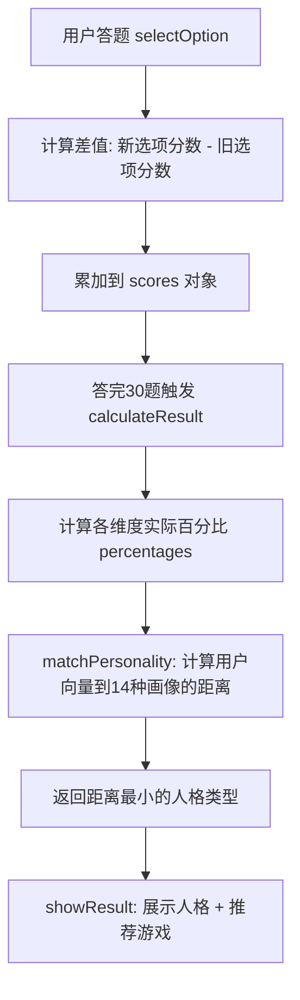

## 用户需求

对游戏人格测试项目的推荐算法进行全面重构，使其分类合理、维度标准清晰、权重科学。

## 产品概述

这是一个"游戏人格测试"单页应用（index.html），用户回答30道题后，系统根据5个维度的得分匹配14种游戏人格，并推荐对应游戏。当前算法存在维度含义模糊、评分逻辑错误、人格匹配公式雷同等严重问题，导致测试结果不准确且多个人格永远无法被匹配到。

## 核心功能（需修改）

1. **重新定义维度体系**：将现有5个维度（attitude/social/competitive/time/style）的含义明确化，消除重叠，使每个维度有清晰独立的衡量标准
2. **重构题目评分机制**：每道题的选项只对其所属维度和强相关维度加分（不再对所有5个维度都加分），消除维度间的干扰
3. **修复评分累加bug**：修复selectOption函数中切换选项时不减去之前分数导致重复累加的bug
4. **修复maxScores计算错误**：改为基于所有题目对该维度实际贡献的最大可能分值来计算
5. **重新设计人格匹配公式**：为14种人格设计差异化的匹配公式，确保每种人格都有独特的维度组合特征，避免公式雷同导致部分人格永远不会被匹配
6. **移除强制推荐皇室战争的逻辑**：推荐游戏完全由人格匹配结果决定

## 技术栈

- 前端：纯HTML + CSS + JavaScript（单文件项目，保持现有架构不变）
- 无外部框架依赖

## 实现方案

### 核心策略

采用"维度正交化 + 主维度加分 + 画像向量距离匹配"的方案，从根本上解决当前算法的分类混乱问题。

### 关键技术决策

#### 1. 维度体系重定义

将5个维度重新定义为正交且含义明确的指标：

| 维度 | 英文 | 衡量标准 | 分值范围 |
| --- | --- | --- | --- |
| 投入度 | dedication | 对游戏的认真程度和时间精力投入 | 0-3 每题 |
| 社交性 | social | 偏好多人互动还是独自游玩 | 0-3 每题 |
| 竞技心 | competitive | 追求胜负和排名的强烈程度 | 0-3 每题 |
| 探索欲 | exploration | 对剧情/收集/世界探索的兴趣 | 0-3 每题 |
| 操作偏好 | action | 偏好硬核操作还是休闲轻松 | 0-3 每题 |


关键改进：将模糊的`attitude`（态度）拆分为`dedication`（投入度）和`exploration`（探索欲），将模糊的`style`（风格）改为`action`（操作偏好），与`competitive`（竞技心）形成清晰区分。`time`改为`dedication`以涵盖更广泛的投入概念。

#### 2. 评分机制重构

- **主维度原则**：每道题标注的dimension字段对应的维度获得主分（0-3分），最多再影响1-2个强相关维度（0-1分），不再给所有维度加分
- **分数计算**：`maxScores`改为遍历所有30题，取每题对该维度最大可能加分的累加值，确保百分比在0-100%范围内
- **切换选项修复**：selectOption在累加新选项分数前，先减去之前选项的分数

#### 3. 人格匹配算法重构

采用"标准画像向量 + 加权欧几里得距离"替代当前的线性加权公式：

```
为每种人格定义5维标准画像向量（L/M/H 三档，对应 25/50/75）
计算用户实际百分比向量到每种画像的加权距离
距离最小者即为匹配结果
```

14种人格标准画像设计原则：

- GOD_HAND（操作怪）：高action + 高competitive + 低social
- STRATEGIST（谋士）：高exploration + 中competitive + 低action
- SOCIAL_BUTTERFLY（开黑狂魔）：高social + 中dedication + 低competitive
- COLLECTOR（全图鉴战士）：高exploration + 高dedication + 低competitive
- CHILL_GAMER（躺平仙人）：低competitive + 低dedication + 低action
- TOXIC_GAMER（峡谷钢琴家）：高competitive + 中social + 高dedication
- NIGHT_OWL（深夜幽灵）：高dedication + 高competitive + 低social
- CASUAL_CUTE（萌萌战士）：低action + 中social + 高exploration
- HARDCORE（受苦传教士）：高action + 高dedication + 低social
- GUILD_LEADER（公会指挥官）：高social + 高dedication + 中competitive
- MOBILE_MASTER（地铁战神）：低dedication + 中social + 中competitive
- STORY_LOVER（剧情鉴赏师）：高exploration + 低competitive + 低action
- OPEN_WORLD（开放世界探险家）：高exploration + 中action + 低competitive
- GACHA_MASTER（抽卡赌怪）：高dedication + 中exploration + 低competitive

这样每种人格在5维空间中有独特位置，不会出现公式雷同的问题。

### 实现注意事项

1. **向后兼容**：保持URL参数分享功能正常工作，personalities对象的key保持不变
2. **评分修复优先级**：selectOption的bug修复必须在评分机制重构时一并完成，否则测试结果会错误
3. **maxScores动态计算**：遍历所有题目的所有选项，取每题对某维度最大分值累加，而非按dimension字段过滤
4. **皇室战争清理**：需要同时清理showResult和checkUrlParams两处的强制添加逻辑

## 架构设计

### 数据流



### 模块修改范围

- **questions数组**（约280行）：重新设计每题选项的score对象，遵循主维度加分原则
- **scores对象和维度名**（约5行）：更新为新的5维度命名
- **selectOption函数**（约15行）：修复重复累加bug
- **calculateResult函数**（约20行）：重构maxScores计算方式
- **matchPersonality函数**（约50行）：用画像向量距离替代线性公式
- **personalities对象的dimensions字段**（约14处）：更新维度展示名
- **showResult和checkUrlParams**（各约5行）：移除强制添加皇室战争

## 目录结构

```
c:\Users\Administrator\Desktop\新的测试\
├── index.html    # [MODIFY] 唯一需要修改的文件，包含全部HTML/CSS/JS代码
│                 #   修改内容：
│                 #   1. questions数组：重设每个选项的score对象（主维度加分原则）
│                 #   2. scores初始化：维度名从attitude/time/style改为dedication/exploration/action
│                 #   3. selectOption函数：增加旧选项分数回退逻辑
│                 #   4. calculateResult函数：改用动态计算maxScores
│                 #   5. matchPersonality函数：改用画像向量距离匹配算法
│                 #   6. personalities对象：更新dimensions展示字段
│                 #   7. showResult/checkUrlParams：移除强制皇室战争逻辑
│                 #   8. 维度展示标签更新（dimensionsGrid渲染部分）
└── 参考.txt      # [不修改] 仅作为SBTI风格参考
```

## 关键代码结构

```typescript
// 新的维度评分体系（每题选项示例）
interface OptionScore {
  dedication: number;   // 0-3, 主维度为dedication的题给0-3，其他题给0-1
  social: number;       // 0-3
  competitive: number;  // 0-3
  exploration: number;  // 0-3
  action: number;       // 0-3
}

// 人格画像向量定义
interface PersonalityProfile {
  dedication: number;   // 25(L) / 50(M) / 75(H) 标准值
  social: number;
  competitive: number;
  exploration: number;
  action: number;
}

// 匹配算法核心：加权欧几里得距离
function matchPersonality(userPcts: Record<string, number>): string {
  // 对每种人格计算距离，返回距离最小的key
  // distance = sqrt(sum(weight_i * (user_i - profile_i)^2))
  // weight_i 根据该人格的关键维度给予更高权重(1.5)，非关键维度权重1.0
}
```

## Agent Extensions

### Integration

- **cloudStudio**
- Purpose: 修改完成后可用于部署前端项目进行在线预览和测试
- Expected outcome: 将修改后的index.html部署到云端，可通过链接访问测试效果